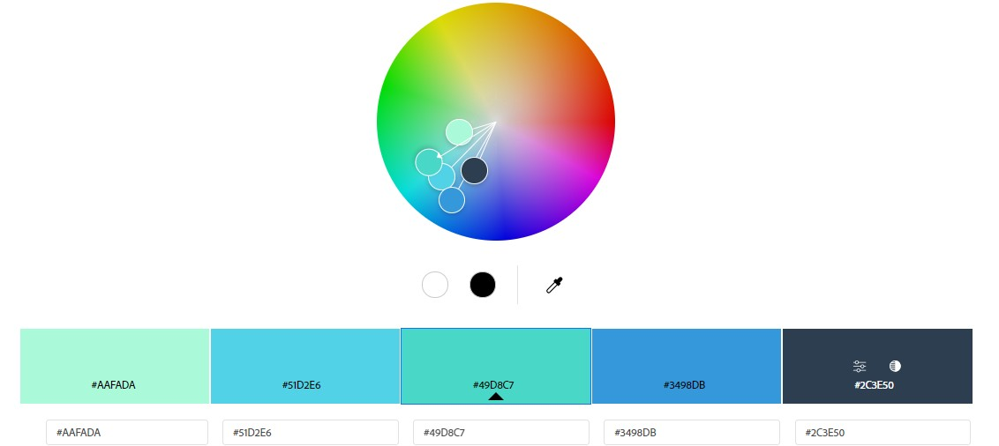
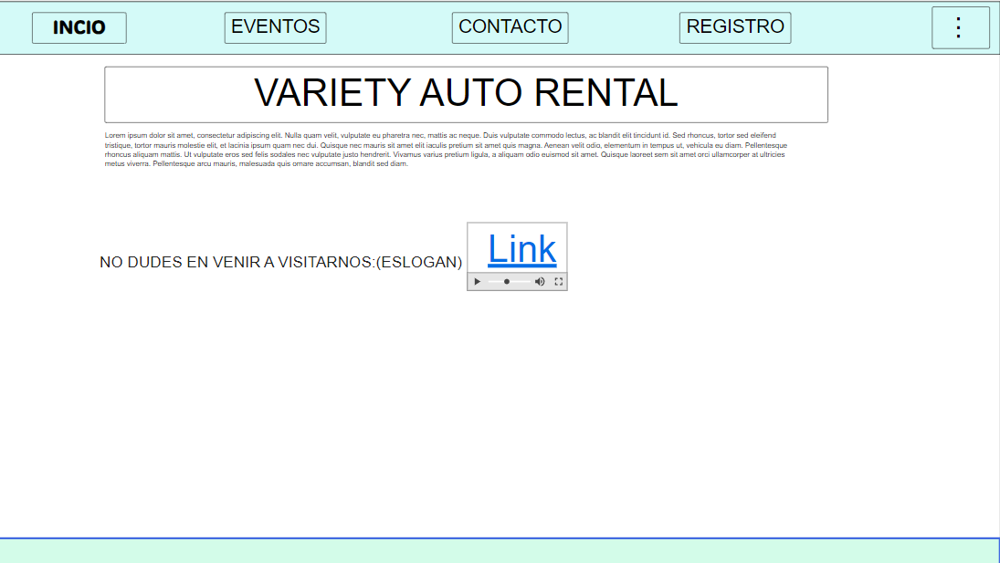
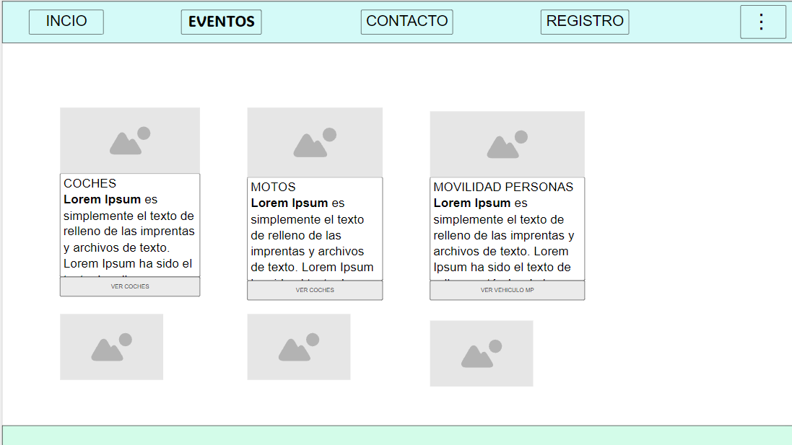
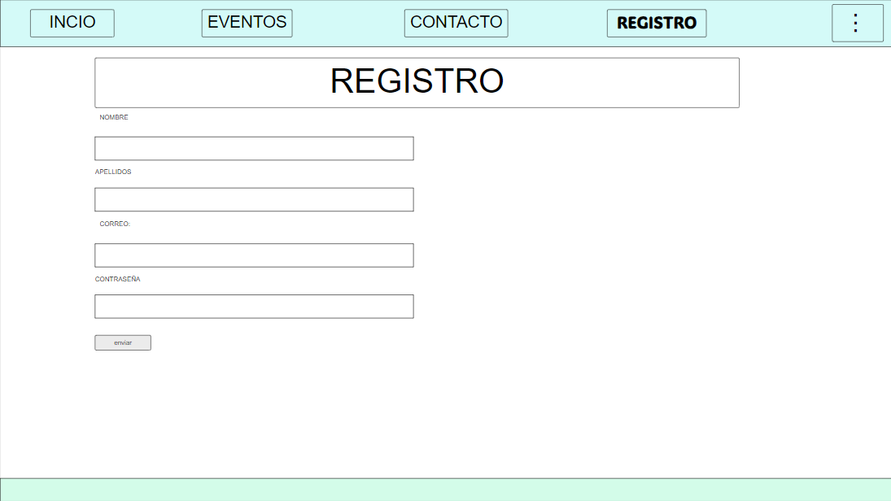
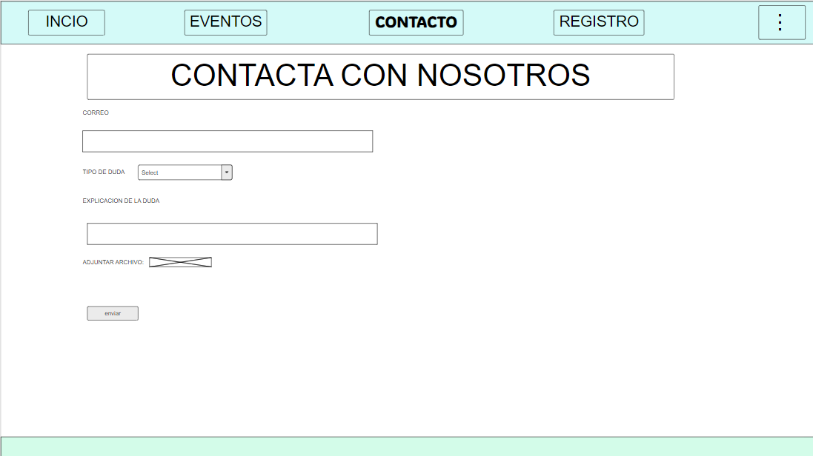

# Proyecto-Asir---KepFit   
Asignatura IAW
## Información general
Este proyecto trata sobre nuestra aplicación de tipo red social con la que podrás disfrutar de diferentes servicios como la interración entre entrenadores y alumnos en tus alrededores, así como la posibilidad de canjear puntos a cambio de productos, maquinaria, entre otras cosas del mundo fitness.
## Autores
2º ASIR

**Enmanuel Holgado Liza**

**Asier Lizarraga**

**Asier Mañeru**

**Rubén Darío**

**Jon Caballero**

URL:

## Aspectos de nuestra página
* Paleta de colores

COLORES: **#AAFADA** **#51D2E6** **#49D8C7** **#3498DB** **#2C3E50**
Estos colores fueron elegidos por que la mayoría de los gimnasios sulen apostar por esta gama de colores vividos simbolizando salud y fuerza.
<!--pedir maqueta a Asier-->
* Fuentes

    Inclusive Sans, Martian Mono
* Prototipos
    * Index Maqueta
      La Maqueta del index esta hecho gracias a otras páginas como referencias, también de gimnasios, donde se explican con gran detalle nuestro proposito de mejorar la salud. 
        
    *  Eventos Maqueta
      Esta maqueta es la típica para la venta de cualquier producto, donde se muestran todo lo que vendemos, ya sea en cartas o en carruseles.
        
    * Registro Maqueta
      Tipico formulario para realizar tanto el inicio de sesion, registro e ingreso a la intranet.
        
    * Contacto Maqueta
        